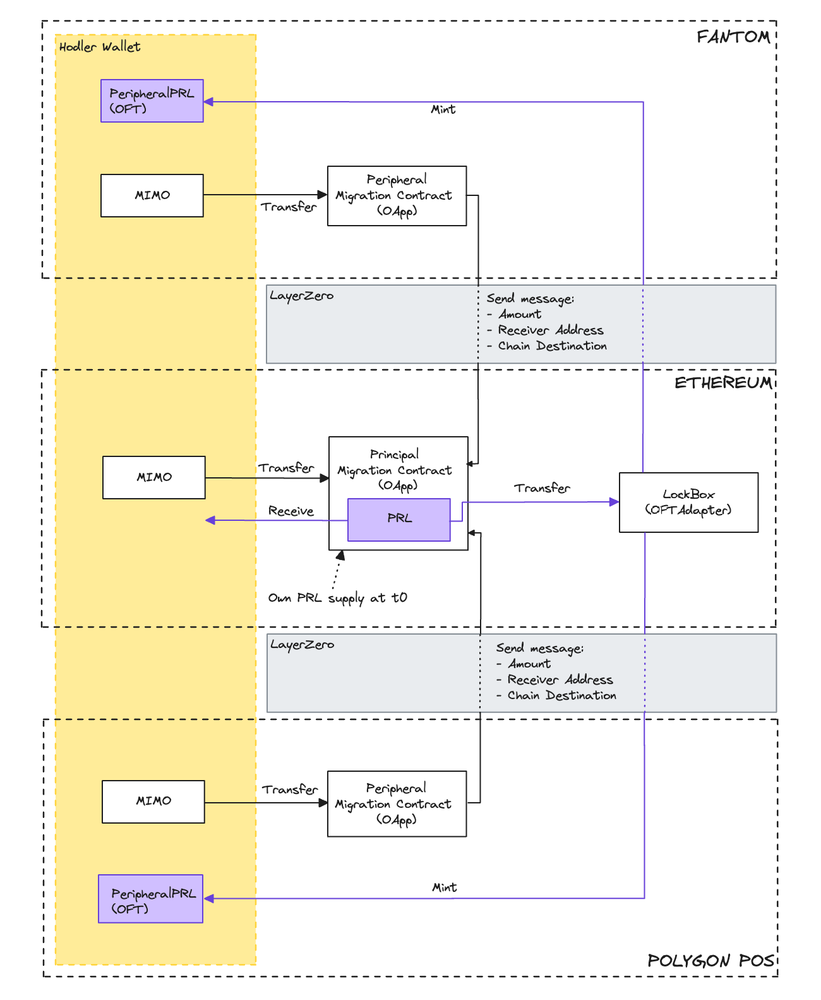

# PRL token

## Overview

This document details features related to the new [PRL](../contracts/principal/PRL.sol) token and the migration from
Mimo token to PRL.

3 types of contracts:

- The [`PRL`](../contracts/principal/PRL.sol) token contract that inherit of Openzeppelin ERC20 and ERC20Permit
  standards.
- The Migrations contracts handled by the
  [`PrincipalMigrationContract`](../contracts/principal/PrincipalMigrationContract.sol) and
  [`PeripheralMigrationContract`](../contracts/peripheral/PeripheralMigrationContract.sol) contracts that leveraging on
  [LayerZero's OApp standard](https://docs.layerzero.network/v2/home/protocol/contract-standards#oapp) for migrating
  Mimo from anychain to PRL on anychain.
- The Bridging of PRL, handled by the [`LockBox`](../contracts/principal/LockBox.sol) and
  [`PeripheralPRL`](../contracts/peripheral/PeripheralPRL.sol) contracts that leveraging on fork of
  [LayerZero's OFT standard](https://docs.layerzero.network/v2/home/protocol/contract-standards#oft) for allow PRL to be
  omnichain.

## Key features

The architecture allows:

- Omnichain migration from MIMO to PRL
- Omnichain PRL

### High level Design

## Contracts

### PRL Token

The [`PRL`](../contracts/principal/PRL.sol) contract is an immutable contract that inherit of Openzeppelin
[ERC20](https://docs.openzeppelin.com/contracts/5.x/api/token/erc20#ERC20) and
[ERC20Permit](https://docs.openzeppelin.com/contracts/5.x/api/token/erc20#ERC20Permit) standards.

### PrincipalMigrationContract

The [PrincipalMigrationContract](../contracts/principal/PrincipalMigrationContract.sol) is the main migration contract
that will be deployed on the same chain as the PRL token. It will own the total supply of PRL at deployment and will
allow users to migrate their Mimo to PRL on the same chain or by receiving omnichain messages from other chains. This
contract inherits from LayerZero's OAppReceiver.

### LockBox

The [LockBox](../contracts/principal/LockBox.sol) will be deployed on the same chain as the PRL token and will allow
user to bridge to/from different chain their PRL. This contract inherit of LayerZero's OFTAdapter that allow tokens'
bridged on other chains to be lock into this contract.

### PeripheralMigrationContract

The [PeripheralMigrationContract](../contracts/peripheral/PeripheralMigrationContract.sol) is the contract deployed on
other chains that allow user to migrate Mimo to PRL from any chain. This contract inherit of LayerZero's OAppSender.

### PeripheralPRL

The [PeripheralPRL](../contracts/peripheral/PeripheralPRL.sol) will be deployed on other chains than where the PRL token
is and will allow user to bridge to/from different chain their PRL. This contract inherit of LayerZero's OFTAdapter.

## Technical Details

### LayerZero standards

The omnichain part is handled by LayerZero that allows cross chain messages. We are using two standard :

- [OApp standard](https://docs.layerzero.network/v2/home/protocol/contract-standards#oapp) used by the MigrationContract
  to send/receive message link Mimo to PRL token migration.
- [OFT standard](https://docs.layerzero.network/v2/home/protocol/contract-standards#oft) used to make the PRL token
  bridgeable between chains.

Each Omnichain contract inherits a specific type of the LayerZero standard :

Migration contracts :

- [PrincipalMigrationContract](../contracts/principal/PrincipalMigrationContract.sol) is an OAppReceiver as its goal is
  to receive migration message.
- [PeripheralMigrationContract](../contracts/peripheral/PeripheralMigrationContract.sol) is an OAppSender as its goal is
  to send migration message to the main chain.

Omnichain PRL:

- [LockBox](../contracts/principal/LockBox.sol) is an OFTAdapter that allow to lock PRL token that has been bridged to
  other chains and to send/receive messages.
- [PeripheraPRL](../contracts/peripheral/PeripheralPRL.sol) is an OFT that will mint/burn PRL on its chain and to
  send/receive messages.

> **Note: By default LayerZero's OFT standard implement shareDecimals/decimalConversionRate to allow amount to be
> accepted on chains like Solana which are not uint256 but uint64. We fork the standard and removed all code related to
> shareDecimals/decimalConversionRate. Forked code is under [layerZero fork](../contracts/layerZero/) folder**

### Migrate from MIMO to PRL

Thanks to the architecture, users will be able to migrate from Mimo to PRL without friction on the chain to
send/receive. Below you will find the possible scenarios:

- Migrate on Main

In this case we just transfer Mimo to the contract from the user and send him PRL.

- Migrate from Main to chain A

In this case we swap Mimo to PRL on the main chain and send the PRL to the LockBox (OFT) that will lock the PRL and send
a message to the PeripheralPRL contract on the destination chain.

- Migrate from chain A to Main

In this case we are using the PrincipalMigrationContract to transfer user's Mimo to itself and send a migration message
to the main chain. Then the PrincipalMigrationContract will receive the message and send PRL to the user.

- Migrate from chain A to chain X

In this case we are using the full architecture to send message from A to X link in the previous case. Then the
PrincipalMigrationContract will create a new message that will be send to the LockBox. The LockBox will transfer PRL
from the PrincipalMigrationContract to itself and send the message to the final chain that will mint PRL to the user.

### Pause

A `pause` function exists to prevent new `send()` and `migrateToPRL()` calls from being executed. This is useful in the
event of a bug or security vulnerability.

Only the **Owner** can call pause

### Unpause

An `unpause` function exists to unpause the contract.

Only the **Owner** can call unpause.

### EmergencyRescue

A `emergencyRescue()` function exists on migration contract to withdraw any tokens owned by the contract.

Only the **Owner** can call emergencyRescue and the contract must be in pause.

## Deployment

Check the [DeployedAddresses.md](./DeployedAddresses.md) file for the deployed addresses on different networks.

## Documentation for audit

For more details on the contract, refer to the [Audit details](./AuditDetails.md).
